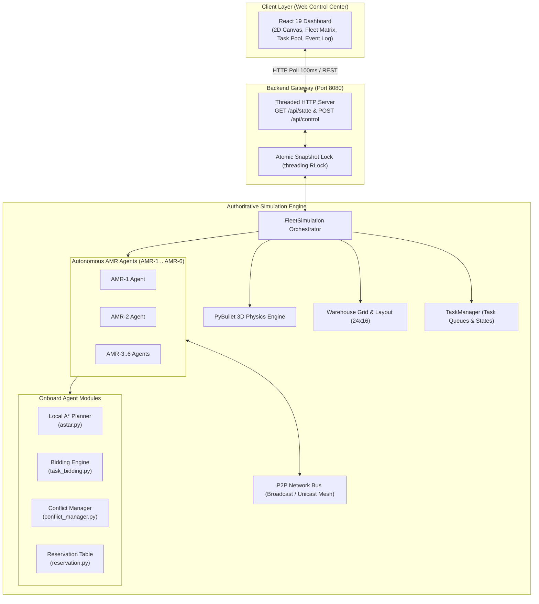
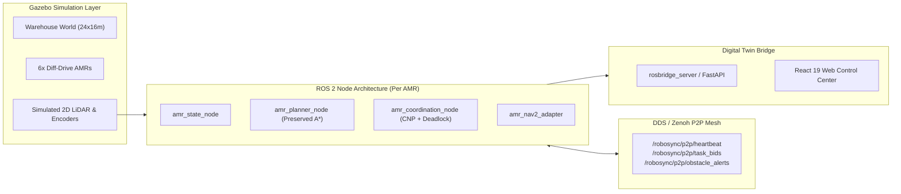

# 🤖 RoboSync

**Edge-AI Based Distributed Fleet Coordination for Autonomous Mobile Robots (AMRs) in Smart Warehouses**

[](https://www.python.org/)
[](https://react.dev/)
[](https://pybullet.org/)
[]()
[](https://www.sih.gov.in/)

---

## 📌 Executive Summary

Modern high-density fulfillment centers and automated warehouses face critical scalability and reliability bottlenecks when relying on **centralized fleet managers**. If a single central controller fails or drops wireless packets, the entire warehouse fleet stalls. Furthermore, centralized Multi-Agent Path Finding (MAPF) scales with exponential time complexity $O(k^N)$, creating severe latency spikes as fleet size grows.

**RoboSync** is a decentralized multi-AMR coordination platform. By embedding decision-making directly onto each AMR as an autonomous Edge-AI agent, RoboSync distributes task allocation, local path planning, and conflict resolution across a peer-to-peer (P2P) mesh network.

---

## 💡 Core Capabilities

- **Decentralized Task Auctioning (Contract Net Protocol):** Tasks broadcasted to the warehouse are evaluated locally by each AMR using marginal pickup/dropoff costs, current battery level, and workload.
- **Onboard A\* Path Planning:** Each AMR independently plans its own trajectory on a 4-connected topological grid using Manhattan distance heuristics.
- **P2P Swarm Mesh Coordination:** AMRs exchange state heartbeats, task bids, intersection requests, and obstacle alerts over a peer-to-peer messaging mesh.
- **Wait-For Graph Deadlock Elimination:** Circular wait dependencies are detected locally using directed wait-for graphs and Depth-First Search (DFS) cycle finding, then resolved via deterministic priority scoring and Breadth-First Search (BFS) safe refuge detours.
- **Dynamic Obstacle Re-Routing:** Unexpected corridor blockages trigger instant P2P hazard alerts and local A\* replanning.
- **Spatial-Temporal Intersection Mutex:** High-density intersections are protected through localized time-windowed reservation tokens.

---

## 🏛️ System Architecture



---

## 🔬 Mathematical Formulation & Key Algorithms

### 1. Onboard A\* Path Planning
Each AMR runs an independent instance of `AStarPlanner` (`simulation_system/planning/astar.py`) on a 4-connected grid:
$$f(n) = g(n) + h(n)$$
Where:
- $g(n)$: Exact path cost from start to node $n$ (uniform cost of $1.0$ per orthogonal cell).
- $h(n)$: Manhattan distance heuristic:
  $$h(n) = |x_n - x_{\text{goal}}| + |y_n - y_{\text{goal}}|$$

### 2. Contract Net Protocol Task Bidding
When a task $T$ is broadcasted, AMR $i$ computes its bid $B_i$ locally (`simulation_system/coordination/task_bidding.py`):
$$B_i = \frac{C_{\text{dist}} + C_{\text{workload}} + C_{\text{battery}} + C_{\text{busy}} + C_{\text{pref}}}{\max(0.1, \text{priority}_T)}$$
- $C_{\text{dist}} = (D(\text{pos}_i, \text{pickup}) + D(\text{pickup}, \text{dropoff})) \times w_{\text{distance}}$
- $C_{\text{battery}} = \left(\frac{100 - \text{battery}_i}{100}\right)^{1.5} \times w_{\text{battery}}$
- **Winner Selection:** $\text{Winner} = \arg\min_{i} B_i$ (tie-breaker: lexicographical robot ID).

### 3. Deadlock Cycle Detection & Safe Yield Resolution
When AMRs face opposing corridor conflicts, `ConflictManager` (`simulation_system/coordination/conflict_manager.py`):
1. **Builds Wait-For Graph:** Constructs directed edges $(A \to B)$ where robot $A$ wants a cell occupied or reserved by robot $B$.
2. **Detects Cycles via DFS:** Identifies circular wait cycles ($A \to B \to A$ or $A \to B \to C \to A$).
3. **Calculates Priority Scores:**
   $$P = W_{\text{phase}} + (\text{priority}_{\text{task}} \times 50.0) + \frac{20.0}{\text{dist}(\text{pos}, \text{goal}) + 1.0} + \left(\frac{\text{battery}}{100.0} \times 5.0\right) + \text{tie\_breaker}$$
   *(where $W_{\text{phase}} = 300.0$ for payload delivery, $200.0$ for pickup transit, $100.0$ for idle).*
4. **BFS Safe Refuge Yield:** The yielding robot runs a Breadth-First Search (BFS up to depth 6) to find the nearest unoccupied, non-conflicting cell, detours into refuge, and lets the priority AMR pass.

---

## 🎮 Interactive Simulation Scenarios

| Scenario | Command Flag | Hotkey | Description |
|---|---|:---:|---|
| **Normal Run** | `--scenario normal` | `N` | Clean idle state ready for interactive custom task creation and dispatch. |
| **6-AMR Swarm** | `--scenario six_amr` | `6` | 6 concurrent AMRs bidding on and executing 6 logistics orders in parallel. |
| **Deadlock Demo** | `--scenario deadlock` | `D` | Head-on corridor confrontation triggering DFS cycle detection, priority arbitration, and BFS refuge yield. |
| **Intersection Demo** | `--scenario intersection` | `I` | Multi-AMR convergence at central intersection $(12, 6)$ demonstrating mutex token locks. |
| **Blocked Aisle** | `--scenario blocked` | `B` | Unexpected obstacle injected at $(11, 13)$; triggers P2P alert and local A\* reroute. |
| **Hardware Fault** | `--scenario failure` | `F` | AMR-2 motor failure injection; triggers emergency task release, re-auctioning, and peer avoidance. |

---

## 🌐 Multi-Laptop Synchronization Architecture

RoboSync supports multi-laptop live demonstration over a Local Area Network (LAN):
- **Host Laptop:** Runs the authoritative Python simulation (`FleetSimulation`) and Vite dev server.
- **Client Laptops:** Connect via browser to `http://<HOST_IP>:5173`.
- **Dynamic Host Resolution:** The frontend automatically connects to `http://<window.location.hostname>:8080/api/state`.
- **Synchronization Safeguards:** Thread-safe state snapshots (`threading.RLock`), monotonically increasing sequence guards, and adaptive polling backoff.

---

## 🗂️ Repository Structure

```
.
├── simulation_system/                 # Authoritative Python Simulation Engine
│   ├── config/config.py               # Grid, AMR kinematics, and bidding parameters
│   ├── coordination/                  # P2P mesh, bidding engine, conflict manager, reservations
│   ├── monitoring/                    # Threaded HTTP server (8080), telemetry snapshots
│   ├── planning/astar.py              # Onboard 4-connected grid A* path planner
│   ├── robots/                        # AMR agent state machine & PyBullet 3D model
│   ├── simulation/                    # PyBullet world & FleetSimulation orchestrator
│   ├── tasks/                         # Task queue, lifecycle, and recovery manager
│   ├── tests/                         # Pytest test suite (A*, deadlocks, task flow)
│   ├── warehouse/                     # 24x16 GridMap, layout generator, benchmark scenarios
│   └── main.py                        # Simulation entry point & CLI parser
│
└── src/                               # React 19 Web Control Center
    ├── components/simulation/         # 2D Canvas Map, Fleet Matrix, Auction Pool, Event Log
    ├── context/SimulationContext.jsx  # Telemetry polling loop & command dispatcher
    ├── services/simulationApi.js       # REST client for GET /api/state and POST /api/control
    └── App.jsx                        # Application root
```

---

## 🚀 Installation & Quickstart

### Prerequisites
- Python 3.10, 3.11, or 3.12
- Node.js 18+ and npm
- macOS, Linux, or Windows (WSL2 / native)

### 1. Python Simulation Backend Setup
```bash
# Navigate to simulation directory
cd simulation_system

# Create and activate virtual environment
python3 -m venv .venv
source .venv/bin/activate  # On Windows: .venv\Scripts\activate

# Install dependencies
pip install --upgrade pip
pip install -r requirements.txt

# Run automated verification tests
pytest tests/ -v

# Launch simulation backend with 3D PyBullet GUI and Web Dashboard
python main.py --scenario normal --num-amrs 6
```

### 2. React Web Control Center Setup
```bash
# In project root directory
npm install
npm run dev -- --host
```
Open **`http://localhost:5173`** in your browser to access the control center.

---

## 🔮 Roadmap: Planned ROS 2 + Gazebo Migration

> [!NOTE]
> The current implementation is a software-level simulation running on PyBullet. The next implementation phase will migrate the system to a fully distributed ROS 2 + Gazebo architecture.



### Planned ROS 2 Package Structure
- `robosync_interfaces`: Custom ROS 2 messages, services, and actions.
- `robosync_gazebo`: Gazebo worlds, SDF models, and launch configurations.
- `robosync_description`: URDF / Xacro differential-drive robot definitions.
- `robosync_planning`: Local A\* path search integrated with Nav2 costmaps.
- `robosync_coordination`: Contract Net task auctioning and wait-for graph deadlock resolution.
- `robosync_amr`: AMR state machine lifecycle node.
- `robosync_fleet`: Multi-robot launch orchestration and benchmark recorder.
- `robosync_bridge`: WebSocket / REST bridge for the React control center.

---

## 📖 Deep Technical Documentation

For the complete technical specification, algorithm deep-dive, research comparisons, and migration guidelines, refer to:
👉 **[`ROBOSYNC_FULL_KNOWLEDGE_TRANSFER.md`](./ROBOSYNC_FULL_KNOWLEDGE_TRANSFER.md)**

---

## 👥 Contributors & Acknowledgements

- **Project Name:** RoboSync (STERLEBOM)
- **Problem Statement ID:** `SIH26123` – Edge-AI Based Distributed Fleet Coordination for Autonomous Mobile Robots in Smart Warehouses
