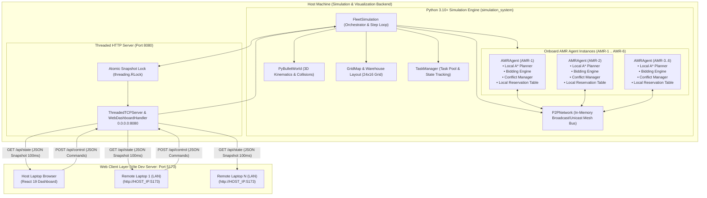
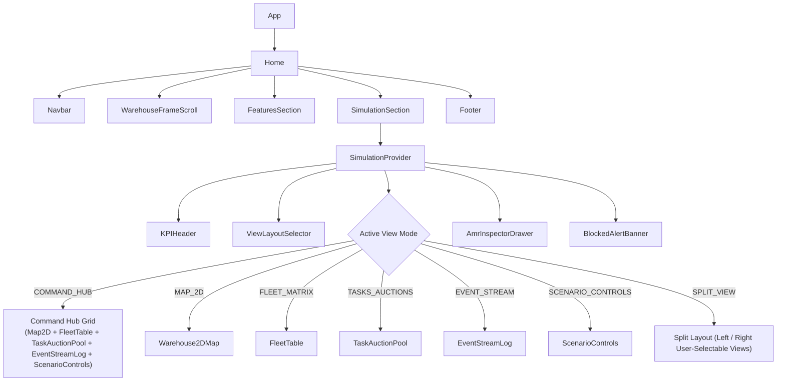
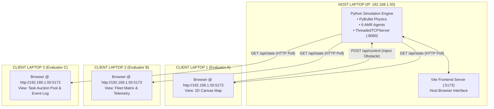
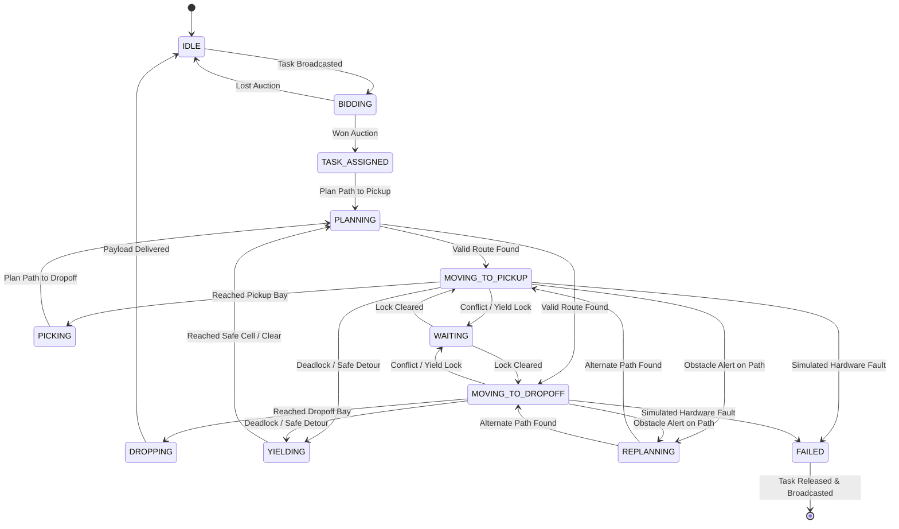
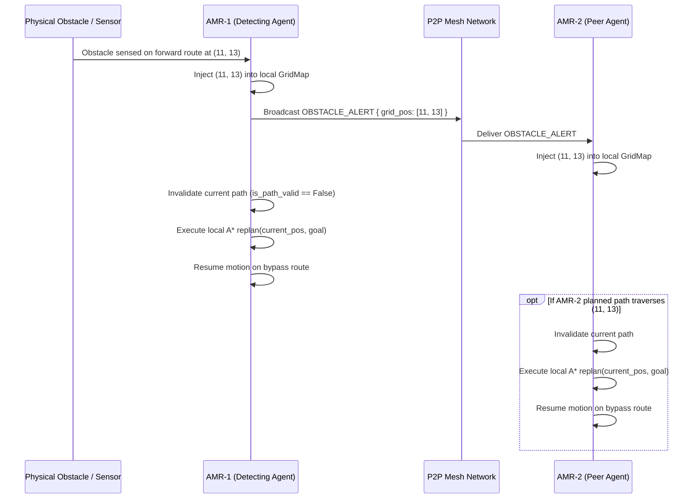
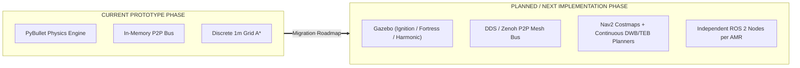
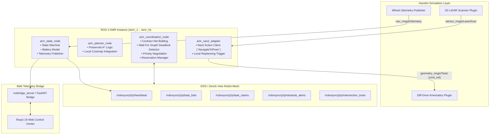
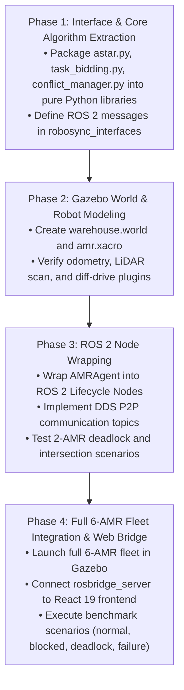

# RoboSync: Full System Technical Knowledge Transfer & Architecture Baseline

> **Document Type:** Canonical Technical Handoff & Repository Baseline Specification  
> **Target Audience:** Incoming Autonomous Robotics Developers, ROS 2 Engineers, Simulation Architects, Hackathon / Research Evaluators  
> **Implementation Phase Status:**  
> - **CURRENT IMPLEMENTATION:** Python 3.10+ Multi-Agent Simulation (PyBullet 3D Physics + Discrete 2D Topological Grid + Software P2P Mesh Bus + Threaded HTTP Server + React 19 / Vite Web Control Center)  
> - **PLANNED / NEXT PHASE:** ROS 2 (Humble/Iron) Distributed Node Architecture + Gazebo Warehouse Physics Simulation + Nav2 Costmaps + Physical / Simulated Hardware Bridge  

---

## 1. Project Overview

**RoboSync** is a decentralized, edge-intelligence-based fleet coordination platform for Autonomous Mobile Robots (AMRs) operating in high-density warehouse and fulfillment environments.

### Core Problem
Conventional automated warehouses typically rely on **centralized fleet managers** (e.g., a central dispatcher assigning all missions and a centralized Multi-Agent Path Finding [MAPF] server computing joint trajectories). Centralized architectures present critical failure modes:
1. **Single Point of Failure (SPOF):** Network packet drops or central server crashes halt the entire facility.
2. **Computational Scalability Bottleneck:** Centralized time-space reservation and coupled MAPF search exhibit exponential time complexity $O(k^N)$ as fleet size $N$ and map size grow.
3. **Bandwidth Saturation:** Constant high-frequency raw telemetry streaming to a central server saturates wireless access points.
4. **Rigid Disturbance Response:** Dynamic aisle obstructions, fallen items, or robot breakdowns require global recalculation rather than localized adaptation.

### RoboSync Solution Paradigm
RoboSync shifts coordination from a centralized server to **onboard edge intelligence**:
- **Decentralized Task Allocation:** Tasks are broadcasted to the fleet; each AMR evaluates marginal pickup/dropoff costs using its onboard A* planner, battery level, and current workload via a Contract Net Protocol auction.
- **Local Onboard Path Planning:** Each robot owns its independent `AStarPlanner` computing collision-free routes on a 4-connected grid with Manhattan distance heuristics.
- **Peer-to-Peer (P2P) Coordination:** AMRs exchange state heartbeats, task bids, intersection reservations, and obstacle alerts over a peer-to-peer messaging mesh.
- **Decentralized Deadlock Detection & Resolution:** Circular wait dependencies are identified locally by constructing directed wait-for graphs and executing cycle-finding Depth-First Search (DFS). Deadlocks are broken through deterministic priority scoring and Breadth-First Search (BFS) safe-yield cell detours.
- **Spatial-Temporal Intersection Mutex:** Key warehouse bottlenecks are protected through localized time-windowed reservation tokens.

---

## 2. Current Architecture

The current repository executes as a **hybrid multi-tier software system**:



### Architectural Distinction: State Authority vs Coordination Logic
1. **Simulation State Authority:** The running Python process (`FleetSimulation`) maintains physical truth (rigid body poses, collision physics, true grid occupancy, and simulation clock). It serves periodic atomic JSON snapshots to external dashboards via HTTP.
2. **P2P Coordination Logic:** Inside the simulation process, each AMR (`AMRAgent`) is instantiated as an independent entity owning its own local grid copy, local A* planner, bidding engine, reservation table, and conflict manager. Decisions (bidding, replanning, yielding) are made using only local knowledge and messages received over the P2P bus.

---

## 3. Repository Structure

```
.
├── .env.example                               # Frontend environment template (VITE_SIMULATION_API_URL)
├── .gitignore                                 # Git ignore patterns
├── index.html                                 # Single Page Application HTML entrypoint
├── package.json                               # React 19, Vite 6, GSAP, Lucide dependencies
├── vite.config.js                             # Vite configuration with @vitejs/plugin-react
│
├── simulation_system/                         # Authoritative Python Simulation Subsystem
│   ├── config/
│   │   ├── __init__.py
│   │   └── config.py                          # Grid, AMR kinematics, bidding weights, conflict parameters
│   ├── coordination/
│   │   ├── __init__.py
│   │   ├── conflict_manager.py                # Wait-for graph, DFS cycle detection, priority scoring, BFS yield
│   │   ├── p2p.py                             # In-memory P2P message bus, broadcast & unicast transceiver
│   │   ├── reservation.py                     # Local spatial-temporal intersection reservation manager
│   │   └── task_bidding.py                    # Contract Net Protocol bidding cost engine
│   ├── monitoring/
│   │   ├── __init__.py
│   │   ├── dashboard.py                       # Telemetry snapshot aggregator & blocked-alert tracker
│   │   └── web_dashboard.py                   # Threaded HTTP server (port 8080) & standalone HTML dashboard
│   ├── planning/
│   │   ├── __init__.py
│   │   └── astar.py                           # 4-connected grid A* path planner with dynamic obstacle support
│   ├── robots/
│   │   ├── __init__.py
│   │   ├── amr_agent.py                       # AMR state machine, P2P packet handlers, local execution loop
│   │   ├── robot_model.py                     # PyBullet 3D geometric box/wheel model & debug overlays
│   │   └── robot_state.py                     # RobotStatus enum and PeerRobotState dataclass
│   ├── simulation/
│   │   ├── __init__.py
│   │   ├── pybullet_world.py                  # PyBullet physics engine initialization, step loop, camera setup
│   │   └── simulation.py                      # FleetSimulation engine, scenario runner, thread-safe command dispatch
│   ├── tasks/
│   │   ├── __init__.py
│   │   ├── task.py                            # WarehouseTask and TaskStatus definitions
│   │   └── task_manager.py                    # Task queue, assignment, lifecycle, and failure recovery
│   ├── tests/
│   │   ├── test_astar_planning.py             # Unit tests for A* planning, bounds, heuristics, replanning
│   │   ├── test_deadlock_resolution.py        # Unit tests for cycle detection, priority, safe yield search
│   │   └── test_interactive_task_flow.py      # Unit tests for end-to-end task bidding and dynamic obstacles
│   ├── utils/
│   │   ├── __init__.py
│   │   ├── logger.py                          # Structured ANSI colored fleet logger & event buffer
│   │   └── metrics.py                         # Fleet metrics: distance, replans, conflicts, deadlocks, collisions
│   ├── warehouse/
│   │   ├── __init__.py
│   │   ├── grid.py                            # GridMap data structure, coordinate transformations, raycasting
│   │   ├── scenarios.py                       # Benchmark scenario definitions (normal, deadlock, blocked, etc.)
│   │   └── warehouse.py                       # Warehouse 3D layout generator (shelves, walls, bays, docks)
│   ├── main.py                                # CLI entrypoint for Python simulation
│   ├── pytest.ini                             # Pytest test suite configuration
│   └── requirements.txt                       # Python dependencies (pybullet, numpy, colorama)
│
├── public/                                    # Static assets, feature slide images, frame animations
│   ├── features/                              # Slide illustrations for feature carousel
│   └── frames/                                # Canvas animation frames
│
└── src/                                       # React Web Application Frontend
    ├── components/
    │   ├── simulation/
    │   │   ├── AmrInspectorDrawer.jsx         # Detailed side-drawer for selected AMR telemetry
    │   │   ├── BlockedAlertBanner.jsx         # Live dynamic blockage & replanning status banner
    │   │   ├── EventStreamLog.jsx             # Real-time event log viewer with level filtering
    │   │   ├── FleetTable.jsx                 # Tabular matrix of all active AMRs, battery, tasks, states
    │   │   ├── KPIHeader.jsx                  # Top executive KPI summary bar
    │   │   ├── ScenarioControls.jsx           # Scenario selection, speed control, pause/resume, obstacle injection
    │   │   ├── TaskAuctionPool.jsx            # Live task auction queue & assignment tracker
    │   │   ├── ViewLayoutSelector.jsx         # View selector (Command Hub, 2D Map, Matrix, Split View)
    │   │   └── Warehouse2DMap.jsx             # Interactive HTML5 2D warehouse canvas with custom task/obstacle tools
    │   ├── FeaturesSection.jsx                # Feature carousel highlighting P2P, Dynamic Routing, Deadlocks
    │   ├── Footer.jsx                         # Application footer & system metadata
    │   ├── Navbar.jsx                         # Liquid frosted-glass navigation bar
    │   ├── SimulationSection.jsx              # Main simulation workspace embedding all sub-components
    │   └── WarehouseFrameScroll.jsx           # Interactive scroll visualizer
    ├── context/
    │   └── SimulationContext.jsx              # React context managing API polling, sequence guards, command dispatch
    ├── pages/
    │   └── Home.jsx                           # Main landing page combining hero, features, and simulation hub
    ├── services/
    │   └── simulationApi.js                   # REST API client for GET /api/state and POST /api/control
    ├── App.jsx                                # Application root
    ├── index.css                              # Design system tokens, dark glassmorphism, responsive styles
    └── main.jsx                               # React DOM root entry point
```

---

## 4. Current Frontend Architecture

The frontend is built using **React 19**, **Vite 6**, **GSAP**, and **Lucide React**.

### Component Hierarchy


### Key UI Features
- **Interactive 2D Warehouse Canvas (`Warehouse2DMap.jsx`):** High-DPI canvas rendering static walls, shelf blocks, pickup/dropoff bays, charging docks, dynamic obstacles, planned paths (color-coded per robot), active waypoints, and animated AMR positions with status labels.
- **Interactive Task Creation Tool:** Click-to-place pickup bay and dropoff bay on walkable grid floor cells to dispatch custom missions (`BLOCK-XX` / `TASK-USER-XX`) directly into the backend auction pool.
- **Dynamic Obstacle Editor:** Click any walkable floor aisle cell to place dynamic blockage barriers; click existing blocked cells to remove them.
- **AMR Inspector Drawer (`AmrInspectorDrawer.jsx`):** Slide-out telemetry drawer showing battery percentage, path length, current waypoints, assigned task details, conflict status, and peer knowledge table.
- **Event Stream Log (`EventStreamLog.jsx`):** Live streaming event log classified by severity (`INFO`, `HIGHLIGHT`, `CONFLICT`, `WARNING`, `ACTION`).

---

## 5. Current Python Simulation Architecture

The simulation engine is implemented purely in Python 3.10+ and executes on the host workstation.

### Key Classes & Responsibilities
| Module | Primary Class | Functionality |
|---|---|---|
| `simulation.simulation` | `FleetSimulation` | Master simulation lifecycle, PyBullet world stepping, scenario loading, thread-safe command queue processing. |
| `simulation.pybullet_world` | `PyBulletWorld` | PyBullet physics engine wrapper (`p.GUI` or `p.DIRECT` headless mode), gravity, camera orientation, and keyboard input polling. |
| `robots.amr_agent` | `AMRAgent` | Edge AMR state machine, waypoint tracking, P2P packet processing, local planner invocation, and physical actuator command issuance. |
| `robots.robot_model` | `RobotModel` | 3D PyBullet multi-body representation (chassis box, wheels, visual debug text overlays). |
| `warehouse.grid` | `GridMap` | 24x16 discrete topological grid representation, cell classification, bounds validation, coordinate conversions, raycasting. |
| `warehouse.warehouse` | `Warehouse` | 3D physical layout builder (shelves, goods boxes, floor markings, dynamic hazard barricades). |
| `tasks.task_manager` | `TaskManager` | Central task registry tracking task status (`PENDING`, `AUCTIONING`, `ASSIGNED`, `IN_PROGRESS`, `COMPLETED`, `FAILED`). |

---

## 6. Backend / API Architecture

The Python backend includes an embedded, zero-dependency HTTP server (`simulation_system/monitoring/web_dashboard.py`).

### HTTP Server Specifications
- **Server Type:** `ThreadedTCPServer` subclassing `socketserver.ThreadingMixIn` and `socketserver.TCPServer`.
- **Port:** `8080` (binds to `0.0.0.0:8080` for local and LAN access).
- **Concurrency Model:** Multi-threaded request handling with daemon threads and `allow_reuse_address = True`.
- **State Synchronization:** Protected by a re-entrant lock (`threading.RLock`) in `FleetDashboard.get_full_state_snapshot()`.

### API Endpoints
#### `GET /api/state`
Returns the complete real-time authoritative simulation snapshot.
```json
{
  "system": {
    "scenario": "NORMAL",
    "sim_time": 14.5,
    "sim_speed": 1.0,
    "is_running": true,
    "is_paused": false,
    "active_amrs": 6,
    "active_planners": 6,
    "tasks_completed": 4,
    "tasks_pending": 0,
    "tasks_active": 2,
    "autonomous_replans": 3,
    "conflicts_resolved": 5,
    "deadlocks_resolved": 1,
    "deadlocks_detected": 1,
    "collision_count": 0,
    "total_distance": 184.2
  },
  "fleet": [
    {
      "robot_id": "AMR-1",
      "status": "MOVING_TO_PICKUP",
      "battery": 96.4,
      "task_id": "TASK-6AMR-1",
      "grid_pos": [3, 8],
      "world_pos": [-8.5, 0.5, 0.0],
      "target_goal": [3, 14],
      "heading": 1.57,
      "current_path": [[3, 9], [3, 10], [3, 11], [3, 12], [3, 13], [3, 14]],
      "completed_tasks": 1,
      "total_distance": 28.4
    }
  ],
  "tasks": [],
  "layout": {},
  "blocked_alert": { "active": false, "obstacle_pos": null, "affected_amr": null, "stage": "CLEAR" },
  "dynamic_obstacles": [[11, 13]],
  "recent_events": []
}
```

#### `POST /api/control`
Receives operator control actions from the web UI and queues them for execution on the simulation thread.
- **Request Format:** `{"action": "<action_name>", "params": { ... }}`
- **Supported Actions:**
  - `start` / `resume`: Unpauses simulation.
  - `pause`: Pauses physics and planning execution.
  - `toggle_pause`: Toggles paused state.
  - `set_speed`: Updates playback multiplier (`{"speed": 2.0}`).
  - `reset`: Restores all AMRs to docking bays, re-initializes task queues.
  - `set_scenario`: Switches active scenario (`{"scenario": "deadlock" | "blocked" | "intersection" | "failure" | "normal" | "six_amr"}`).
  - `add_obstacle` / `inject_obstacle`: Adds dynamic obstacle at grid cell (`{"cell": [11, 13]}`).
  - `remove_obstacle`: Removes dynamic obstacle from cell (`{"cell": [11, 13]}`).
  - `clear_obstacles`: Clears all dynamic obstacles.
  - `create_custom_task`: Creates custom task from grid coordinates (`{"pickup": [3, 8], "dropoff": [15, 8], "priority": 1.5, "task_id": "BLOCK-01"}`).
  - `stop`: Halts simulation loop.

---

## 7. Multi-Laptop Synchronization Architecture

RoboSync supports multi-laptop live demonstration over a local area network (LAN):



### Multi-Client Synchronization Safeguards
1. **Dynamic Host Resolution (`simulationApi.js`):** In browser context, the frontend dynamically discovers the backend API host using `window.location.hostname:8080`, removing hardcoded `localhost` references when accessed from remote devices.
2. **Local Storage Override:** Users can manually override the target API URL via `simulationApi.setApiUrl()` without rebuilding frontend bundles.
3. **Sequence Guarding (`SimulationContext.jsx`):** Monotonically increasing request sequence counters (`currentReqSeqRef`, `lastCompletedSeqRef`) guarantee that slow or out-of-order network responses never overwrite newer state snapshots.
4. **Adaptive Polling Backoff:** The client polls every 100ms when connected; upon 3 consecutive network failures, it backs off to 1000ms polling to prevent network saturation.
5. **Thread-Safe Snapshot Extraction:** `dashboard.py` acquires an `RLock` during state extraction, ensuring partial AMR updates are never serialized mid-step.

---

## 8. Warehouse / Grid Representation

The warehouse topology is modeled as a 2D discrete grid lattice with metric coordinates:

- **Dimensions:** $24 \times 16$ cells (Width: 24, Height: 16).
- **Cell Metric Resolution:** $1.0\text{ m} \times 1.0\text{ m}$ per cell.
- **World Coordinate Frame Origin:** World $(0, 0, 0)$ is at grid center; Grid cell $(0, 0)$ maps to world coordinate $(x = -12.0\text{ m}, y = -8.0\text{ m})$.

### Coordinate Transformations
$$\text{world\_x} = \text{origin\_x} + (\text{grid\_x} + 0.5) \times \text{cell\_size} = -12.0 + (\text{gx} + 0.5) \times 1.0$$
$$\text{world\_y} = \text{origin\_y} + (\text{grid\_y} + 0.5) \times \text{cell\_size} = -8.0 + (\text{gy} + 0.5) \times 1.0$$
$$\text{grid\_x} = \left\lfloor \frac{\text{world\_x} - \text{origin\_x}}{\text{cell\_size}} \right\rfloor, \quad \text{grid\_y} = \left\lfloor \frac{\text{world\_y} - \text{origin\_y}}{\text{cell\_size}} \right\rfloor$$

### Structural Layout Features
- **Outer Perimeter Walls:** Wall cells at $x=0$, $x=23$, $y=0$, $y=15$.
- **Shelf Storage Racks:** 6 structural blocks:
  - Left West Aisles: $(x \in [5, 10], y \in [3, 4])$, $(x \in [5, 10], y \in [8, 9])$, $(x \in [5, 10], y \in [11, 12])$
  - Right East Aisles: $(x \in [14, 19], y \in [3, 4])$, $(x \in [14, 19], y \in [8, 9])$, $(x \in [14, 19], y \in [11, 12])$
- **Pickup Stations (North Shore):** $P_1 = (3, 14)$, $P_2 = (8, 14)$, $P_3 = (15, 14)$, $P_4 = (20, 14)$.
- **Drop-off Stations (South Shore):** $D_1 = (3, 1)$, $D_2 = (8, 1)$, $D_3 = (15, 1)$, $D_4 = (20, 1)$.
- **Dedicated AMR Charging Docks:**
  - `AMR-1`: $(1, 2)$ | `AMR-2`: $(22, 2)$ | `AMR-3`: $(1, 13)$
  - `AMR-4`: $(22, 13)$ | `AMR-5`: $(1, 7)$ | `AMR-6`: $(22, 7)$
- **Key Central Intersections:**
  - $I_1 = (12, 6)$ (Central highway crossing)
  - $I_2 = (12, 10)$ (North-Central highway crossing)
  - $I_3 = (12, 2)$ (South-Central highway crossing)
  - $I_4 = (3, 6)$ (West lateral aisle intersection)
  - $I_5 = (20, 6)$ (East lateral aisle intersection)

---

## 9. AMR State and Telemetry

Each AMR executes a discrete state machine defined in `robots/robot_state.py` and managed in `robots/amr_agent.py`:



### Telemetry Attributes Broadcasted via P2P
- `position`: Continuous 3D world pose $(x, y, z)$.
- `grid_pos`: Current discrete grid coordinates $(gx, gy)$.
- `heading`: Yaw angle in radians.
- `status`: Current `RobotStatus` enum value.
- `current_task_id`: Assigned task ID or `None`.
- `destination`: Final target cell coordinates.
- `intended_path`: List of future grid waypoints $(x, y)$.
- `battery`: State of charge ($0.0 - 100.0\%$).
- `workload`: Number of queued/active missions.
- `waiting_for`: Peer ID causing wait/yield lock.
- `priority_score`: Deterministic negotiation priority score.

---

## 10. A* Implementation

The local onboard path planner is implemented in `simulation_system/planning/astar.py` as class `AStarPlanner`.

### Mathematical Formulation
For any grid node $n$:
$$f(n) = g(n) + h(n)$$
Where:
- $g(n)$: Exact path cost accumulated from the start node to node $n$. Each orthogonal grid step has a uniform transition cost of $1.0$.
- $h(n)$: Admissible and consistent **Manhattan distance heuristic** to the target goal $(x_{\text{goal}}, y_{\text{goal}})$:
  $$h(n) = |x_n - x_{\text{goal}}| + |y_n - y_{\text{goal}}|$$

### Implementation Details
- **Search Space:** 4-connected grid (North, South, East, West orthogonal neighbors).
- **Data Structures:** Priority queue (`heapq` storing tuples `(f_score, g_score, tie_breaker_counter, node)`), `came_from` dictionary for path reconstruction, `g_score` hash map, and `closed_set` hash set.
- **Constraint Filtering:** Dynamic obstacles, static obstacles, peer occupancy, and active spatial-temporal reservation locks are unified into a `restricted_cells` set.
- **Output Container (`PathPlanResult`):** Returns the reconstructed path list, total path cost, visited node count, expanded node count, planning time in milliseconds, and replan iteration index.

---

## 11. P2P Coordination Implementation

The peer-to-peer communication layer is implemented in `simulation_system/coordination/p2p.py` as class `P2PNetwork`.

> [!NOTE]
> In the current implementation, `P2PNetwork` is a **software-level simulation abstraction** executing in memory. It simulates RF broadcast and unicast message passing between independent AMR transceiver callbacks without a central communication server.

### P2P Message Envelope (`P2PMessage`)
- `msg_type`: Enum `MessageType`
- `sender_id`: Originating robot ID (`"AMR-1"`, `"WAREHOUSE_SENSORS"`, etc.)
- `recipient_id`: Target robot ID or `"BROADCAST"`
- `payload`: Dictionary containing message-specific data
- `timestamp`: Epoch timestamp in seconds

### Message Types
| Message Type | Purpose | Payload Contents |
|---|---|---|
| `HEARTBEAT_STATE` | 10 Hz state broadcast for peer awareness | Position, grid cell, status, task ID, intended path, battery, priority score |
| `TASK_BID` | Broadcast auction bid for an announced task | `task_id`, `bid_cost` |
| `TASK_CLAIM` | Winner announces task claim to fleet | `task_id`, `winner_id` |
| `TASK_RELEASE` | Faulty AMR releases task back to auction | `task_id`, `failed_grid_pos` |
| `INTERSECTION_REQUEST` | AMR requests lock on intersection cell | `cell`, `robot_id`, `start_time`, `end_time` |
| `INTERSECTION_RELEASE` | AMR releases intersection lock | `cell`, `robot_id` |
| `OBSTACLE_ALERT` | AMR/sensor broadcasts unexpected blockage | `grid_pos` $(x, y)$ |

---

## 12. Task Auction / Bidding Implementation

Decentralized task allocation is implemented in `simulation_system/coordination/task_bidding.py` via class `TaskBiddingEngine`, adhering to the **Contract Net Protocol (CNP)**.

### Autonomous Bid Cost Formula
When task $T$ is broadcasted, AMR $i$ computes its bid $B_i$:
$$B_i = \frac{C_{\text{dist}} + C_{\text{workload}} + C_{\text{battery}} + C_{\text{busy}} + C_{\text{pref}}}{\max(0.1, \text{priority}_T)}$$

Where:
- $C_{\text{dist}} = (D(\text{pos}_i, \text{pickup}) + D(\text{pickup}, \text{dropoff})) \times w_{\text{distance}}$ (computed using local A* path lengths; default $w_{\text{distance}} = 1.0$)
- $C_{\text{workload}} = \text{workload}_i \times w_{\text{workload}}$ (default $w_{\text{workload}} = 5.0$)
- $C_{\text{battery}} = \left(\frac{100 - \text{battery}_i}{100}\right)^{1.5} \times w_{\text{battery\_penalty}}$ (default $w_{\text{battery\_penalty}} = 10.0$)
- $C_{\text{busy}} = 100.0$ if AMR is already performing an active task, else $0.0$
- $C_{\text{pref}} = -50.0$ if AMR matches the task's preferred target, else $0.0$

### Winner Determination
Each AMR collects peer bids over the P2P bus into a local table:
$$\text{Winner} = \arg\min_{i} B_i$$
- **Tie-Breaker:** Lexicographical order of `robot_id`.
- **Decentralized Agreement:** The winning AMR self-identifies and broadcasts `TASK_CLAIM`. Peers receive the claim and clear their local bid entries.

---

## 13. Deadlock Detection

Deadlock management is implemented in `simulation_system/coordination/conflict_manager.py` within class `ConflictManager`.

### Wait-Dependency Graph Construction (`build_wait_graph`)
Each AMR constructs a directed dependency graph $G = (V, E)$:
- **Vertices ($V$):** Active AMRs in the warehouse.
- **Directed Edges ($A \to B$):** AMR $A$ is blocked or waiting to enter a cell currently occupied, reserved, or headed into by AMR $B$.

#### Dependency Scenarios:
1. **Direct Cell Occupancy:** The next waypoint of AMR $A$ equals the current grid position of AMR $B$.
2. **Head-on Confrontation (Opposing Corridors):** AMR $A$'s intended path overlaps AMR $B$'s grid position *and* AMR $B$'s intended path overlaps AMR $A$'s grid position.
3. **Mutual Trajectory Contention:** Both AMRs attempt to enter the same corridor intersection simultaneously.

### DFS Cycle Detection (`detect_deadlock_cycles`)
The system detects circular wait conditions using Depth-First Search (DFS) with a recursion stack:
- **2-Robot Cycle (Head-on confrontation):**
  $$A \to B \to A$$
- **3-Robot Cycle (Intersection gridlock):**
  $$A \to B \to C \to A$$
- **Normalized Representation:** Cycles are canonicalized to avoid duplicate processing across peers.

---

## 14. Deadlock Resolution

Once a cycle is detected, `ConflictManager` resolves it through deterministic negotiation and physical refuge yielding:

### 1. Deterministic Priority Scoring (`calculate_priority_score`)
Each AMR in the cycle calculates its priority score $P$:
$$P = W_{\text{phase}} + (\text{priority}_{\text{task}} \times 50.0) + \frac{20.0}{\text{dist}(\text{pos}, \text{goal}) + 1.0} + \left(\frac{\text{battery}}{100.0} \times 5.0\right) + \text{tie\_breaker}$$

Where mission phase weights $W_{\text{phase}}$ enforce:
- $W_{\text{phase}} = 400.0$: Active station bay operation (`PICKING`, `DROPPING` - non-interruptible).
- $W_{\text{phase}} = 300.0$: Moving to dropoff with payload (`MOVING_TO_DROPOFF`).
- $W_{\text{phase}} = 200.0$: Moving to pickup bay (`MOVING_TO_PICKUP`).
- $W_{\text{phase}} = 100.0$: Idle or returning to dock (`IDLE`, `COMPLETED`).
- $\text{tie\_breaker} = (\text{hash}(\text{robot\_id}) \pmod{1000}) \times 0.001$.

### 2. Arbitration and Action Assignment
- **Winner ($\arg\max P$):** Receives `ConflictAction.PROCEED`, holds its route, and advances through the corridor.
- **Yielding AMR ($\arg\min P$):** Receives `ConflictAction.YIELD_TO_SAFE_CELL` or `ConflictAction.YIELD_AND_WAIT`.

### 3. BFS Safe Yield Search (`find_safe_yield_cell`)
The yielding robot runs a Breadth-First Search (BFS) up to depth 6:
- Finds the nearest reachable cell that is:
  1. Inside warehouse boundaries and statically walkable.
  2. Not occupied by any peer AMR.
  3. Not on the priority AMR's planned route window (6-step forward clearance).
  4. Not currently reserved by another peer.
- The yielding robot computes an A* path into the safe cell, steps aside, waits for the priority robot to clear the bottleneck, and subsequently replans back to its mission goal.

---

## 15. Dynamic Obstacle Detection & Replanning

Dynamic re-routing is distributed across `GridMap`, `P2PNetwork`, and `AMRAgent`:



### Replanning Safeguards
- **Replanning Cooldown (`replan_cooldown = 0.5s`):** Prevents high-frequency replanning loops when blocked by a transient obstacle.
- **Dynamic Obstacle Broadcast:** When one robot detects an obstacle, all peers receive the alert and avoid the cell in future A* searches.

---

## 16. Intersection Reservation

Intersection safety is managed by `LocalReservationManager` (`simulation_system/coordination/reservation.py`):

- **Mechanism:** Critical intersection cells (e.g., central highway $(12, 6)$) require a time-windowed reservation lock before traversal.
- **Lookahead Window:** Approaching AMRs inspect the next 4 steps of their planned path (`lookahead_steps = 4`).
- **Lock Acquisition:** An approaching robot broadcasts `INTERSECTION_REQUEST` with duration $4.0\text{ s}$.
- **Lock Release:** Upon clearing the intersection, the holding robot broadcasts `INTERSECTION_RELEASE`.
- **Stale Reservation Expiry:** If a robot fails to release a lock, reservations automatically expire after $\text{time\_window\_end} + 3.0\text{ s}$.

---

## 17. Simulation Orchestration

`FleetSimulation` (`simulation_system/simulation/simulation.py`) coordinates the physical simulation loop:

- **Physics Stepping:** PyBullet world stepped at $\Delta t = \frac{1}{60}\text{ s}$ ($60\text{ Hz}$).
- **Control Frequency:** Robot control loop stepped at $20\text{ Hz}$.
- **Safety Proximity Checker (`_check_safety_proximity`):** Continuously computes Euclidean distance between all AMR pairs:
  $$\text{dist}(A_i, A_j) = \sqrt{(x_i - x_j)^2 + (y_i - y_j)^2}$$
  If $\text{dist} < \text{body\_length} \times 0.85$ ($0.765\text{ m}$), an auditable collision event is logged in `FleetMetrics`.
- **Command Queue Processing:** Thread-safe dispatch ensures API commands (`pause`, `resume`, `reset`, `set_scenario`, `inject_obstacle`) execute strictly on the physics thread.

---

## 18. Web Dashboard

The repository provides two dashboard interfaces:
1. **Embedded Zero-Dependency HTML Dashboard (`web_dashboard.py`):** Self-contained dark-mode single-file web dashboard served on `http://localhost:8080/`.
2. **Production React Web Control Center (`src/`):** Full React 19 application providing interactive 2D canvas navigation, live metrics, custom task builder, obstacle editor, and telemetry drill-downs.

---

## 19. Frontend SimulationContext Synchronization

`SimulationContext.jsx` connects React to the Python backend:

- **State Polling:** Continuous `fetch()` loop to `/api/state` at $100\text{ ms}$ intervals.
- **Sequence Protection:** `currentReqSeqRef` and `lastCompletedSeqRef` ensure old responses are discarded.
- **Reactive Action Dispatch:** Submitting an action via `sendControl()` immediately triggers an eager state fetch, ensuring instant visual feedback on button clicks.

---

## 20. Current Interactive Simulation Scenarios

The system includes 7 executable demonstration scenarios:

| Scenario ID | Name | Core Technical Focus |
|---|---|---|
| `normal` | Normal Run | Clean idle warehouse state ready for interactive custom task creation and dispatch. |
| `six_amr` | 6-AMR Swarm Operations | 6 concurrent AMRs bidding on and executing 6 logistics orders across all 4 pickup bays. |
| `deadlock` | Deadlock Elimination Demo | Head-on corridor confrontation along central highway ($x=12$); triggers DFS cycle detection, priority score arbitration, and BFS safe refuge yield. |
| `intersection` | Intersection Contention Demo | Multi-AMR convergence at central bottleneck $(12, 6)$; demonstrates mutex token lock and queueing. |
| `reservation` | Spatial-Temporal Reservation | Lookahead 4D space-time reservations across key warehouse junctions. |
| `blocked` | Blocked Aisle Re-routing | Obstacle injection at $(11, 13)$ or active AMR route; triggers `OBSTACLE_ALERT` and local A* detour. |
| `failure` | Hardware Fault & Self-Healing | AMR-2 motor failure injection; triggers `TASK_RELEASE`, emergency re-auctioning, and peer obstacle avoidance. |

---

## 21. Current Limitations

An honest assessment of the current codebase reveals the following boundaries:

1. **Discrete Grid Navigation:** Path planning operates on a discrete $1.0\text{ m}$ grid lattice; continuous non-holonomic kinematics and trajectory smoothing (e.g., Dubins / TEB curves) are simulated at the visual/steering layer rather than the planning layer.
2. **Synchronous In-Memory P2P Bus:** The current P2P network runs inside a single Python process via memory callbacks with zero packet loss and minimal latency jitter.
3. **Synthetic Perception:** Obstacles are registered via explicit grid coordinates and state broadcasts rather than raw LiDAR point clouds, 2D laser scans, or camera depth imagery.
4. **Single-Process Orchestration:** All AMR agents execute within a single multi-threaded Python runtime.

---

## 22. Research-Paper Comparison

The following table compares RoboSync against five landmark academic research paradigms in multi-robot warehouse coordination:

| Research Direction | Problem Addressed | Core Algorithm / Approach | Communication / Middleware | Experimental Setup | How RoboSync Differs |
|---|---|---|---|---|---|
| **1. Decentralized Auction-Based Task Allocation** | Distributed task assignment without central dispatcher | Contract Net Protocol (CNP) with marginal cost bidding based on travel distance and battery | Peer-to-peer / mesh message passing *(Specific middleware not specified in the provided paper)* | Multi-robot grid simulation *(Specific simulator not specified in the provided paper)* | RoboSync integrates CNP bidding directly with onboard A* path distance estimates and dynamic battery wear penalty curves. |
| **2. SC-ICBS (Scheduling-Urgency Conflict-Based Search)** | Multi-agent path finding with time windows and deadline urgencies | Two-level conflict-based search incorporating scheduling urgency heuristics | Centralized solver / search tree *(Specific middleware not specified in the provided paper)* | Discrete grid benchmarks with tens to hundreds of agents *(Specific hardware not specified in the provided paper)* | SC-ICBS is a centralized MAPF algorithm; RoboSync uses decentralized local A* planning with runtime wait-for graph deadlock resolution. |
| **3. CREST (Constraint-Release Execution)** | Runtime plan execution monitoring and flexible schedule adjustment | Dynamic constraint network with selective constraint release during delays | Centralized dispatch with decentralized execution monitoring *(Specific middleware not specified in the provided paper)* | Multi-robot warehouse benchmark suite *(Specific simulator not specified in the provided paper)* | CREST dynamically adjusts global temporal constraints; RoboSync uses localized P2P spatial-temporal intersection reservations and safe-yield BFS searches. |
| **4. Flow-Inspired Scheduling Planner** | High-density warehouse corridor congestion management | Fluid dynamics analogy / traffic flow potential fields for directional guidance | Global coordination layer *(Specific middleware not specified in the provided paper)* | Simulation grid with high-density AMR traffic *(Specific simulator not specified in the provided paper)* | Flow-based methods impose continuous potential flow fields; RoboSync uses discrete orthogonal corridor rules, mutex locks, and priority arbitration. |
| **5. Large-Scale Multi-Robot Coverage Path Planning** | Complete area inspection / coverage by multiple mobile robots | Cellular decomposition and spanning-tree / wavefront coverage heuristics | Centralized partitioning or localized broadcast *(Specific middleware not specified in the provided paper)* | 2D environment simulation *(Specific simulator not specified in the provided paper)* | Coverage path planning focuses on exhaustive grid traversal; RoboSync focuses on point-to-point logistics pickup-and-delivery with conflict elimination. |

---

## 23. Why ROS 2 + Gazebo is the Next Step

Migrating from the current PyBullet prototype to **ROS 2 + Gazebo** represents the natural evolutionary step toward industrial deployment:



### Strategic Objectives of ROS 2 + Gazebo Migration:
1. **True Distributed Process Isolation:** Each AMR will execute as an independent ROS 2 node (or containerized lifecycle node) with its own process space and DDS domain.
2. **Realistic Sensor Pipelines:** Simulated 2D/3D LiDAR, wheel odometry, and IMU data streaming via standard ROS 2 sensor topics (`sensor_msgs/msg/LaserScan`, `nav_msgs/msg/Odometry`).
3. **Continuous Costmap Navigation:** Upgrading from discrete grid cells to continuous 2D occupancy costmaps with inflation radii and Nav2 local trajectory controllers.
4. **Hardware-in-the-Loop (HIL) Readiness:** Direct compatibility with physical mobile robot platforms (e.g., TurtleBot4, Clearpath AMRs) and micro-ROS motor microcontrollers.

---

## 24. Proposed ROS 2 Architecture (PLANNED)

> [!IMPORTANT]
> The following ROS 2 architecture is **PROPOSED FOR THE NEXT PHASE** and is not yet implemented in the current codebase.



---

## 25. Proposed ROS 2 Topics, Services, Actions & Messages (PLANNED)

### Proposed Custom Interfaces (`robosync_interfaces`)
- **Messages (`msg/`):**
  - `AmrState.msg`: `string robot_id`, `geometry_msgs/Pose pose`, `uint8 status`, `float32 battery`, `string current_task_id`, `geometry_msgs/Point[] intended_path`, `float32 priority_score`.
  - `TaskBid.msg`: `string task_id`, `string robot_id`, `float32 bid_cost`.
  - `TaskClaim.msg`: `string task_id`, `string winner_id`.
  - `ObstacleAlert.msg`: `string reporter_id`, `geometry_msgs/Point obstacle_pos`, `builtin_interfaces/Time timestamp`.
  - `IntersectionReservation.msg`: `geometry_msgs/Point intersection_cell`, `string holder_id`, `builtin_interfaces/Time start_time`, `builtin_interfaces/Time end_time`.
- **Services (`srv/`):**
  - `InjectObstacle.srv`: Request $(x, y)$, Response `bool success`.
  - `CreateTask.srv`: Request pickup/dropoff/priority, Response `string task_id`.
  - `TriggerScenario.srv`: Request scenario name, Response `bool success`.
- **Actions (`action/`):**
  - `ExecuteWarehouseTask.action`: Goal (pickup/dropoff bays), Feedback (phase, ETA, distance), Result (completion time, success).

---

## 26. Proposed Gazebo Architecture (PLANNED)

### World Environment Model (`warehouse.sdf` / `warehouse.world`)
- **Metric Grid Dimensions:** Identical $24\text{ m} \times 16\text{ m}$ floor plan with $1.0\text{ m}$ wall heights.
- **Shelves:** 6 storage racks with realistic collision boxes and visual pallet models.
- **Stations:** Visual ground decals for Pickup bays $P_1-P_4$ and Dropoff bays $D_1-D_4$.
- **Lighting:** Realistic overhead warehouse bay lighting.

### Robot Model (URDF / Xacro)
- **Chassis:** Differential-drive rectangular AMR chassis ($0.7\text{ m} \times 0.9\text{ m} \times 0.35\text{ m}$).
- **Actuation:** Two active drive wheels with continuous torque control and two passive omnidirectional castors.
- **Sensors:**
  - 2D Planar LiDAR scanner ($10\text{ m}$ range, $360^\circ$ FOV, $10\text{ Hz}$).
  - Wheel encoders streaming `nav_msgs/Odometry` to `/amr_X/odom`.
  - Joint state publisher for wheel transforms.
- **TF Tree:** `world` $\to$ `map` $\to$ `odom` $\to$ `base_footprint` $\to$ `base_link` $\to$ `laser_link`.

---

## 27. Proposed ROS 2 Package Structure (PLANNED)

```
robosync_ws/
└── src/
    ├── robosync_interfaces/           # Custom ROS 2 msg, srv, and action definitions
    ├── robosync_gazebo/               # Gazebo worlds, launch files, models, materials
    ├── robosync_description/          # AMR URDF/Xacro models, mesh files, sensor plugins
    ├── robosync_planning/             # Onboard A* planner, costmap translation layer
    ├── robosync_coordination/         # CNP task bidding, conflict manager, wait-for graph, reservations
    ├── robosync_amr/                  # AMR state machine lifecycle node, execution supervisor
    ├── robosync_fleet/                # Fleet monitoring, scenario manager, metric recorder
    └── robosync_bridge/               # ROS 2 WebSocket / REST bridge for React Web Dashboard
```

---

## 28. Migration Strategy

To ensure zero algorithmic regression during the ROS 2 migration, follow this **4-Stage Phased Migration**:



---

## 29. Testing Strategy

### 1. Existing Automated Python Tests
Run the current test suite before making any modifications:
```bash
cd simulation_system
pytest tests/ -v
```
- `test_astar_planning.py`: Verifies A* optimality, 4-connectivity, bounds checks, dynamic obstacle avoidance, and replanning counts.
- `test_deadlock_resolution.py`: Verifies wait-for graph cycle detection (2-AMR and 3-AMR), priority calculation, and safe-yield BFS cell finding.
- `test_interactive_task_flow.py`: Verifies Contract Net Protocol bidding, task assignment, and obstacle alerts.

### 2. Planned ROS 2 Verification Suite
- **Colcon Test:** `colcon test --packages-select robosync_planning robosync_coordination`
- **Gazebo Headless Launch Test:** Automated launch script verifying 0 physical collisions across a 60-second headless run.

---

## 30. What Must NOT be Changed During Migration

> [!CAUTION]
> The following core algorithmic invariants must be strictly preserved during the ROS 2 migration:

1. **Local A\* Heuristic & Formulation:** Do not replace $f(n) = g(n) + h(n)$ with unvalidated black-box planners. Manhattan distance $h(n) = |x - x_{\text{goal}}| + |y - y_{\text{goal}}|$ must remain consistent.
2. **Contract Net Bidding Cost Formula:** The mathematical cost calculation incorporating distance, workload penalty, battery depletion curve, and task priority must remain identical.
3. **Wait-For Graph DFS Cycle Detection:** The directed wait graph construction and DFS recursion stack cycle detection must be preserved.
4. **BFS Safe Refuge Yield Search:** The safe yield cell search must continue to use Breadth-First Search with route-clearance filtering.
5. **Decentralized Principle:** No central path planning master node may be introduced.

---

## 31. Current Claims vs Planned Claims

To maintain complete academic integrity and technical defensibility, the project enforces strict boundaries between current verification and planned capabilities:

| Feature / Metric | Current Prototype State | Planned ROS 2 / Gazebo Phase |
|---|---|---|
| **Physics Simulation** | 3D Rigid-Body Physics via PyBullet | Multi-robot physics via Gazebo / Ignition |
| **Path Search** | 2D Discrete Grid ($1.0\text{ m}$ cells) | Continuous Costmaps + Nav2 local planners |
| **P2P Communication** | In-Memory Broadcast/Unicast Mesh Bus | DDS / Eclipse Zenoh Decentralized Discovery |
| **Deadlock Resolution** | Verified (Wait-For Graph + DFS + BFS Yield) | Embedded in ROS 2 Coordination Node |
| **Collision Safety** | Verified 0 Collisions in PyBullet Suite | Verified 0 Collisions in Gazebo Physics Suite |
| **Obstacle Detection** | Verified via Grid Coordinate Injection & P2P Alert | Sensed via Simulated 2D LiDAR Scan |
| **Robot Kinematics** | Continuous Yaw / Differential Steering in PyBullet | ROS 2 Diff-Drive / Twist Actuation |
| **Fleet Monitoring** | Verified React 19 / Vite Web Control Center | ROS 2 WebSocket / WebRTC Digital Twin |

---

## 32. Final Developer Handoff Checklist

Before writing new code or beginning the ROS 2 migration, verify the following baseline checklist:

- [x] Python virtual environment active (`.venv/bin/activate`).
- [x] Simulation dependencies installed (`pybullet`, `numpy`, `colorama`).
- [x] Frontend dependencies installed (`react`, `react-dom`, `vite`, `gsap`, `lucide-react`).
- [x] All 3 Python test suites passing cleanly (`pytest tests/ -v`).
- [x] Frontend builds cleanly with zero errors (`npm run build`).
- [x] Backend verified on port `8080` and frontend on port `5173`.
- [x] No unauthorized modifications to planning, coordination, or API modules.
