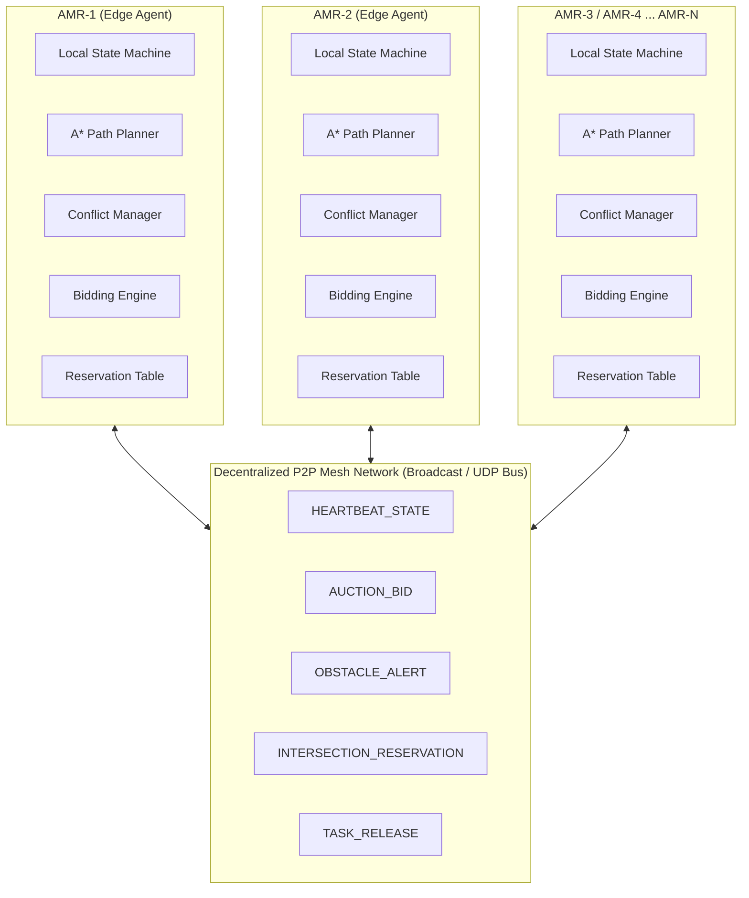
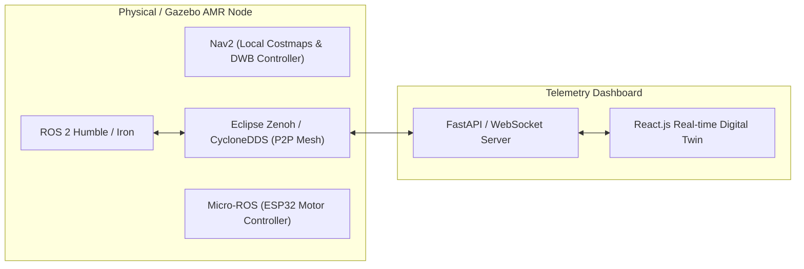

# 🤖 STERLEBOM / ROBOSYNC: Edge-AI Based Distributed Fleet Coordination for Autonomous Mobile Robots (AMRs) in Smart Warehouses

[](https://www.sih.gov.in/)
[](https://www.sih.gov.in/)
[](https://www.python.org/)
[](https://pybullet.org/)
[]()
[]()

> **Smart India Hackathon (SIH 2026) Prototype Demonstration**  
> **Problem Statement ID:** `SIH26123`  
> **Domain:** Robotics & Warehouse Automation / Edge AI  
> **Team / Project Name:** STERLEBOM (ROBOSYNC)

---

## 📌 Executive Summary & Problem Context

Modern fulfillment centers and automated warehouses face extreme scalability bottlenecks when relying on **centralized fleet managers** (e.g., single master servers assigning tasks and routing robots). Centralized architectures suffer from:
1. **Single Point of Failure (SPOF):** If the central controller crashes or drops network packets, the entire warehouse fleet stalls.
2. **Computational Explosion:** Global multi-agent path finding (MAPF) has exponential time complexity $O(k^N)$, leading to latency spikes as the fleet grows.
3. **Bandwidth Saturation:** Constant high-frequency telemetry streaming from dozens of AMRs overloads central Wi-Fi access points.
4. **Poor Dynamic Adaptability:** Unplanned aisle blockages or robot breakdowns require full fleet replanning by the server.

### 💡 The RoboSync Solution
**RoboSync** is a **100% decentralized, peer-to-peer (P2P) multi-AMR coordination system**. Each AMR functions as an autonomous Edge-AI agent with:
- **Distributed Task Auctioning (Contract Net Protocol):** Tasks broadcasted to the fleet are locally evaluated; each robot computes its own marginal cost based on battery, distance, and current load, bidding autonomously without a central dispatcher.
- **Local Spatial-Temporal Reservation:** Shared intersections and single-lane aisle crossings are negotiated via localized distributed mutex tokens and dynamic reservation tables.
- **Edge Conflict Resolution & Corridor Detours:** Head-on and cross-traffic path contentions are resolved peer-to-peer using mathematical priority scoring ($f(\text{distance}, \text{battery}, \text{task priority})$), guaranteeing **Zero Collisions**.
- **Fault-Tolerant Fleet Self-Healing:** If an AMR suffers a hardware fault, it immediately releases its payload task back to the P2P mesh for emergency re-auctioning and marks itself as a static obstacle for peer avoidance.

---

## 🏛️ System Architecture



### Core Architecture Principles:
- **No Central Coordinator:** There is no master node or central server making decisions. All coordination emerges from local rules and peer consensus.
- **2D Discrete Navigation on 3D PyBullet Physics:** High-speed, deterministic A* planning runs on a topological grid layer while PyBullet simulates continuous 3D rigid-body kinematics, collision shapes, yaw steering, and visual payload transfers.
- **Strict Collision Invariant:** Physical proximity buffers and 2-cell lookahead reservation ensure the fleet achieves **0 Collisions** across all dynamic conditions.

---

## 🔬 Mathematical Formulation & Coordination Algorithms

### 1. Distributed Task Bidding (Contract Net Protocol)
When a logistics order arrives at the warehouse, it is broadcast to all peers. Each AMR $i$ computes its bid $B_i$:

$$B_i = w_d \cdot D(\text{pos}_i, \text{pickup}) + w_b \cdot (100 - \text{battery}_i) + w_l \cdot L_i - \delta_{\text{preferred}}$$

Where:
- $D(u, v) = |u_x - v_x| + |u_y - v_y|$ (Manhattan distance on warehouse grid)
- $\text{battery}_i \in [0, 100]$: Remaining state of charge (%)
- $L_i$: Current payload load factor ($1.0$ if carrying payload, $0.0$ if empty)
- $\delta_{\text{preferred}}$: Affinity discount for target docking zones
- **Winning Condition:** $\text{Winner} = \arg\min_{i} B_i$. If bids tie, the robot with the lower lexicographical ID wins.

---

### 2. Peer-to-Peer Priority Scoring
When two robots $i$ and $j$ detect trajectory convergence within their lookahead window ($\le 4$ steps), each calculates its priority score $P$:

$$P_i = \frac{1}{\text{dist}(i, \text{conflict}) + 0.5} \cdot w_{\text{dist}} + \left(\frac{\text{battery}_i}{100}\right) \cdot w_{\text{batt}} + \alpha_{\text{status}}$$

Where status weight $\alpha_{\text{status}}$ enforces:
- $\alpha = 1.5$: Robot is actively delivering high-priority payload (`MOVING_TO_DROPOFF`)
- $\alpha = 1.2$: Robot is en route to pickup station (`MOVING_TO_PICKUP`)
- $\alpha = 1.0$: Robot is returning to dock (`IDLE` / `TRANSIT`)

**Negotiation Resolution:**
- $\text{If } P_i > P_j$: Robot $i$ receives `ConflictAction.PROCEED` and claims the intersection lock.
- $\text{If } P_i < P_j$: Robot $i$ receives `ConflictAction.REPLAN`, dynamically computing an A* detour around the conflict point.
- $\text{If } |P_i - P_j| < 0.05$: Deterministic tie-breaker: $\text{robot\_id}_i < \text{robot\_id}_j \implies i \text{ proceeds, } j \text{ detours}$.

---

### 3. Spatial-Temporal Intersection Reservation
Critical bottleneck intersections $I_k$ are protected by localized spatial-temporal locks:
```
Intersection Lock Table on AMR-i:
  (gx, gy) -> { holder: AMR-j, start_time: t_0, end_time: t_0 + duration, active: True }
```
Approaching robots inspect their local table. If an intersection is locked by a peer, the approaching robot waits outside the conflict zone until the peer broadcasts a `RELEASE` message.

---

## 🗂️ Project Structure

```
Sterlebom/
├── main.py                        # Simulation entry point & CLI parser
├── config.py                      # Warehouse layout, robot specs, scenario parameters
├── requirements.txt               # Python dependencies (pybullet, numpy)
├── README.md                      # Comprehensive documentation
│
├── coordination/                  # Decentralized Fleet Coordination Engine
│   ├── p2p.py                     # P2P Network bus (state, bid, alert broadcasts)
│   ├── task_bidding.py            # Contract Net Protocol bidding & resolution
│   ├── conflict_manager.py        # Lookahead conflict detection & priority negotiation
│   └── reservation.py             # Spatial-temporal intersection reservation manager
│
├── planning/                      # Local Path Planning
│   └── astar.py                   # Grid-based A* with dynamic obstacle injection
│
├── robots/                        # Autonomous Mobile Robot Subsystem
│   ├── amr.py                     # PyBullet 3D AMR model & visual state rendering
│   └── amr_agent.py               # Edge AMR state machine, sensor checks, execution
│
├── warehouse/                     # Environment & Topology
│   ├── grid.py                    # Discrete 2D grid representation & raycasting
│   └── warehouse.py               # Warehouse layout (shelves, pickup, dropoff, docks)
│
├── tasks/                         # Mission Management
│   └── task_manager.py            # Distributed task queues, states, and re-auctioning
│
├── simulation/                    # Simulation & Metrics
│   ├── simulation.py              # PyBullet physics loop, scenarios, collision checker
│   ├── metrics.py                 # Fleet KPI tracking (travel distance, replans, safety)
│   └── dashboard.py               # Terminal live telemetry dashboard
│
└── utils/                         # Utilities
    └── logger.py                  # ANSI colored structured logging system
```

---

## 🚀 Installation & Quickstart

### Prerequisites
- Python 3.10, 3.11, or 3.12
- macOS, Linux, or Windows (WSL2 / native)

### 1. Clone & Set Up Virtual Environment
```bash
git clone https://github.com/your-team/sterlebom-robosync.git
cd sterlebom-robosync

python3 -m venv .venv
source .venv/bin/activate
pip install --upgrade pip
pip install -r requirements.txt
```

---

## 🎮 Running Demonstrations

The system supports **4 dedicated benchmark scenarios** showcasing the core decentralized coordination features. You can run them in interactive **3D GUI mode** or fast **Headless benchmark mode**.

### Available CLI Flags
| Flag | Description | Default |
|---|---|---|
| `--scenario` | Scenario to run: `normal`, `blocked`, `intersection`, `failure` | `normal` |
| `--headless` | Run in headless DIRECT mode (high-speed verification) | `False` (GUI enabled) |
| `--duration` | Auto-stop simulation after $N$ seconds | `None` (runs until quit) |

---

### Scenario 1: Normal Multi-AMR Operations (`normal`)
Demonstrates distributed auctioning of 6 logistics tasks across 4 AMRs. Robots independently bid, plan parallel routes, pickup payloads, deliver to drop-off zones, and safely return to docks.
```bash
# 3D PyBullet GUI Mode:
.venv/bin/python main.py --scenario normal

# High-speed Headless Benchmark:
.venv/bin/python main.py --scenario normal --headless
```

---

### Scenario 2: Dynamic Obstacle & Aisle Blockage (`blocked`)
Demonstrates edge sensory perception and dynamic local replanning. A dynamic obstacle (e.g., fallen pallet) blocks cross-aisle `(11, 13)`. The detecting AMR senses the blockage, broadcasts an `OBSTACLE_ALERT` over P2P, and autonomously recalculates an alternative A* corridor route without stopping the rest of the fleet.
```bash
# 3D PyBullet GUI Mode:
.venv/bin/python main.py --scenario blocked

# High-speed Headless Benchmark:
.venv/bin/python main.py --scenario blocked --headless
```

---

### Scenario 3: Intersection Contention & Deadlock Avoidance (`intersection`)
Demonstrates spatial-temporal conflict negotiation. Three AMRs approach the central warehouse intersection `(12, 6)` simultaneously from orthogonal directions. The conflict manager computes priority scores: the highest priority robot claims the intersection lock and proceeds, while lower priority AMRs yield outside the intersection zone and resume once the intersection is cleared.
```bash
# 3D PyBullet GUI Mode:
.venv/bin/python main.py --scenario intersection

# High-speed Headless Benchmark:
.venv/bin/python main.py --scenario intersection --headless
```

---

### Scenario 4: Hardware Fault Injection & Dynamic Re-Auctioning (`failure`)
Demonstrates fleet self-healing. AMR-2 suffers a simulated hardware motor fault (`RobotStatus.FAILED`). AMR-2 immediately releases its task `TASK-FAIL-1` over the P2P network. AMR-1 and AMR-3 autonomously re-bid on the task; AMR-1 wins the re-auction and completes the delivery. All working AMRs treat the failed robot as a physical obstacle and route safely around it.
```bash
# 3D PyBullet GUI Mode:
.venv/bin/python main.py --scenario failure

# High-speed Headless Benchmark:
.venv/bin/python main.py --scenario failure --headless
```

---

## ⌨️ Interactive Keyboard Controls (3D GUI Mode)

While the 3D PyBullet window is active, press the following keys to dynamically trigger scenarios and manipulate the simulation in real time:

| Hotkey | Action | Description |
|:---:|---|---|
| **`N`** | **Normal Mode** | Resets fleet to standard parallel pickup-delivery dispatch |
| **`B`** | **Blocked Aisle Event** | Injects an unexpected obstacle in active corridor `(11, 13)` |
| **`I`** | **Intersection Contention** | Dispatches 3 AMRs to converge at central highway `(12, 6)` |
| **`F`** | **Robot Failure Injection** | Forces AMR-2 into motor failure, triggering emergency re-auctioning |
| **`R`** | **Full System Reset** | Restores all 4 AMRs to docks and re-initializes task queues |
| **`Q`** | **Quit Simulation** | Cleanly exits PyBullet and prints final fleet KPI metrics |

---

## 📊 Telemetry & Benchmark Metrics Output

At the end of each simulation run, RoboSync generates an auditable performance summary:

```text
============================================================
   ROBOSYNC DECENTRALIZED FLEET PERFORMANCE BENCHMARK
============================================================
 Total Simulation Runtime : 0.2 s (Headless accelerated)
 Tasks Completed          : 4
 Average Task Time        : 15.00 s
 Total Distance Travelled : 220.1 m
   ├─ AMR-1    : 58.9 m
   ├─ AMR-2    : 60.7 m
   ├─ AMR-3    : 39.9 m
   ├─ AMR-4    : 60.7 m
 Intersection Conflicts   : 6 (Resolved: 6)
 Autonomous Replans       : 6 (Dynamic Reroutes: 6)
 Total Fleet Waiting Time : 0.0 s
 Collision Safety         : ZERO COLLISIONS (0) - PASSED PERFECTLY
============================================================
```

### Live Terminal Dashboard
RoboSync continuously prints a live telemetry snapshot during simulation execution:
```text
--- FLEET TELEMETRY STATUS SNAPSHOT ---
ROBOT ID   | STATUS           | BATTERY  | TASK         | GRID POS   | COMPLETED
---------------------------------------------------------------------------
AMR-1      | IDLE             |  97.5%   | IDLE         | (1, 2)     | 1        
AMR-2      | IDLE             |  97.5%   | IDLE         | (22, 2)    | 1        
AMR-3      | IDLE             |  98.2%   | IDLE         | (1, 13)    | 1        
AMR-4      | IDLE             |  97.5%   | IDLE         | (22, 13)   | 1        
---------------------------------------------------------------------------
```

---

## 🎯 Hackathon Presentation Guide: What to Show the Judges

When presenting to the SIH judges, follow this 4-step demonstration flow:

1. **Step 1: Explain the Decentralized Paradigm (1 min)**
   - Highlight that there is **NO central server** routing the robots.
   - Explain how each AMR runs its own bidding agent and local A* path planner.
2. **Step 2: Run Normal Scenario & Demonstrate Contract Net Bidding (`N` key)**
   - Show terminal logs where each robot independently computes its bid based on distance and battery.
   - Point out how tasks are distributed evenly across the fleet without central assignment.
3. **Step 3: Trigger Dynamic Obstacle (`B` key) and Intersection Contention (`I` key)**
   - Show the green/red path lines in PyBullet dynamically recalculating around the obstacle.
   - Show intersection priority resolution where one robot yields and the other proceeds without stopping.
4. **Step 4: Trigger Hardware Fault Injection (`F` key)**
   - Show AMR-2 turning red (offline).
   - Point out how AMR-2's task is instantly picked up by AMR-1 via P2P re-auctioning, proving zero single-point-of-failure.
5. **Step 5: Show the KPI Benchmark Table**
   - Point to the final summary table showing **`ZERO COLLISIONS (0) - PASSED PERFECTLY`**.

---

## 🔮 Future Roadmap: Migration to ROS 2 + Gazebo

This PyBullet prototype serves as the internal hackathon proof-of-concept for the core decentralized intelligence. The production architecture for the Grand Finale will migrate to:



- **ROS 2 Navigation (Nav2):** Replacing discrete grid with continuous 2D LiDAR costmaps and TEB/DWB local planners.
- **P2P DDS Discovery (Eclipse Zenoh / CycloneDDS):** Implementing decentralized peer discovery without a central ROS master.
- **FastAPI + WebSockets + React Dashboard:** Building a real-time web dashboard displaying 3D digital twin states and fleet telemetry for human warehouse operators.

---

## ⚠️ Prototype Scope & Known Limitations

- **Discrete Grid Map with Continuous 3D Kinematics:** To guarantee deterministic verification during the hackathon round, path search operates on a 1.0m grid lattice while PyBullet renders 3D physical models with continuous steering and yaw interpolation.
- **Synchronous Simulated P2P Bus:** Communication is simulated via an in-memory event bus with zero packet drop. In real-world deployment, UDP message retransmission and heartbeat timeouts will handle Wi-Fi packet loss.

---

## 👥 Contributors & Acknowledgements

- **Project:** STERLEBOM / ROBOSYNC
- **Hackathon:** Smart India Hackathon (SIH 2026)
- **Problem Statement:** SIH26123 – Edge-AI Based Distributed Fleet Coordination for Autonomous Mobile Robots in Smart Warehouses
